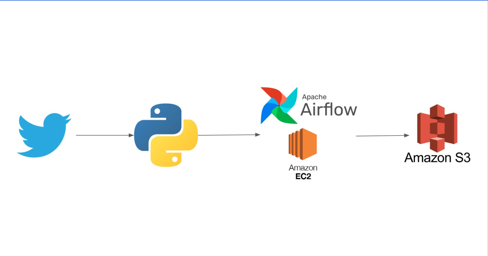

# Airflow Twitter ETL: Elon Musk → S3 (EC2)

Extract Elon Musk’s tweets using the Twitter API (Tweepy), orchestrate a daily ETL with Apache Airflow on EC2, and store outputs on Amazon S3.

## Key files
- DAG: `src/dags/twitter_dag.py`
- ETL: `src/twitter_etl.py`
- Setup: `scripts/twitter_commands.sh`
